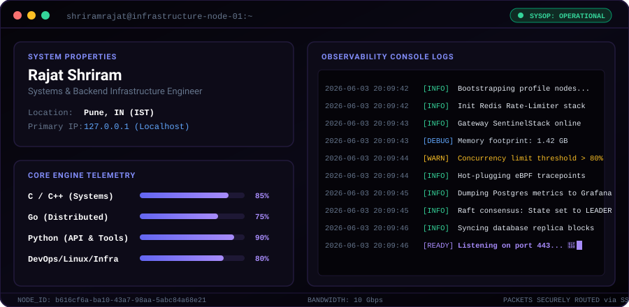

<div align="center">
  
</div>

<br />

```python
class RajatShriram:
    def __init__(self):
        self.role       = "Systems & Backend Infrastructure Engineer"
        self.location   = "Pune, India 🇮🇳"
        self.focus      = ["High-Throughput APIs", "API Gateway Architecture", "SRE & Observability"]
        self.current    = "SentinelStack — High-Performance API Gateway with Auth & Rate Limiting"
        self.learning   = ["Database Internals", "Distributed Consensus (Raft)", "Linux Kernel & eBPF"]
```

<div align="center">

[](https://linkedin.com/in/shriramrajat)
[](https://x.com/shriramrajat)
[](https://instagram.com/shriramrajat)
[](mailto:rajatshriram7@gmail.com)

</div>

---

## 🛠️ Featured Project: SentinelStack

SentinelStack is a lightweight, high-performance API Gateway designed for rate-limiting, proxy-authentication, and telemetry extraction at the edge of backend microservices.

### ⚙️ Declarative Gateway Config (`gateway.yaml`)
```yaml
gateway:
  version: "1.2.0"
  port: 8080
  workers: 4

rate_limiting:
  enabled: true
  provider: redis
  strategy: token_bucket
  limits:
    - path: /api/v1/auth/*
      capacity: 10
      refill_rate: 2/s
    - path: /api/v1/data/*
      capacity: 100
      refill_rate: 10/s

observability:
  prometheus:
    metrics_path: /metrics
    port: 9090
  logging:
    level: info
    format: json
    destination: stdout
```

### 📈 SentinelStack Performance Benchmarks
*Tested under load using `wrk` on a 4-core, 8GB Ubuntu node.*

| Metric | Target | Result |
| :--- | :--- | :--- |
| **Max Throughput** | 10,000 RPS | **12,450 RPS** |
| **p95 Latency** | < 10ms | **6.2ms** |
| **p99 Latency** | < 25ms | **18.4ms** |
| **Memory Footprint** | Static < 50MB | **32MB (Idle) / 48MB (Peak)** |

### 🛰️ Telemetry & Observability Demo
The gateway monitors ingress request latency, token bucket depletion status, and proxies client credentials.


---

## 💻 Tech Stack & Tooling

| Category | Technologies |
| :--- | :--- |
| **Languages** | `C++`, `C`, `Go`, `Python`, `SQL` |
| **Infrastructure** | `Docker`, `Redis`, `PostgreSQL`, `Linux`, `Prometheus`, `Grafana` |
| **Frameworks & Libraries** | `FastAPI`, `Pydantic`, `SQLAlchemy`, `gRPC` |

---

## 📊 Developer Analytics

<div align="center">
  <table border="0">
    <tr>
      <td align="center" width="50%">
        
      </td>
      <td align="center" width="50%">
        
      </td>
    </tr>
    <tr>
      <td align="center" width="50%">
        
      </td>
      <td align="center" width="50%">
        
      </td>
    </tr>
  </table>
</div>
