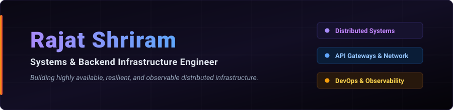

<div align="center">
  
</div>

<br />

```python
class RajatShriram:
    def __init__(self):
        self.role       = "Systems & Backend Infrastructure Engineer"
        self.location   = "Pune, India 🇮🇳"
        self.focus      = ["High-Throughput APIs", "API Gateway Architecture", "SRE & Observability"]
        self.current    = "SentinelStack — High-Performance API Gateway with Auth & Rate Limiting"
        self.learning   = ["Database Internals", "Distributed Consensus (Raft)", "Linux Kernel & eBPF"]
```

<div align="center">

[](https://linkedin.com/in/shriramrajat)
[](https://x.com/shriramrajat)
[](https://instagram.com/shriramrajat)
[](mailto:rajatshriram7@gmail.com)

</div>

---

## 🛠️ Featured Project: SentinelStack

An API Gateway designed to handle authentication, rate limiting, and structured observability at scale.

* **Core Engineering**:
  * Implemented **Token Bucket** rate-limiting via **Redis** to ensure low-latency request throttling.
  * Integrated **Prometheus** metrics export and **Grafana** dashboards to monitor throughput, latency, and error rates.
  * Built structured JSON logging for high-performance log parsing and audit trails.
  * Containerized workflow with **Docker** and **Docker Compose** for seamless orchestration.


---

## 💻 Tech Stack & Tooling

| Category | Technologies |
| :--- | :--- |
| **Languages** | `C++`, `C`, `Go`, `Python`, `SQL` |
| **Infrastructure** | `Docker`, `Redis`, `PostgreSQL`, `Linux`, `Prometheus`, `Grafana` |
| **Frameworks & Libraries** | `FastAPI`, `Pydantic`, `SQLAlchemy`, `gRPC` |

---

## 📊 GitHub Analytics

<div align="center">
  <table border="0">
    <tr>
      <td align="center" width="50%">
        
      </td>
      <td align="center" width="50%">
        
      </td>
    </tr>
    <tr>
      <td align="center" width="50%">
        
      </td>
      <td align="center" width="50%">
        
      </td>
    </tr>
  </table>
</div>
